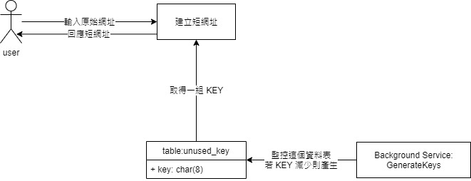

# 短網址系統

# Table of Contents
- [背景知識](#背景知識)
- [安裝](#安裝)
- [如何使用](#如何使用)
    - [啟用產生短網址服務](#啟用產生短網址代碼服務)
- [api](#api)
  - [建立短網址](#建立短網址)
  - [短網址轉址](#短網址轉址)
- [Maintainers](#maintainers)

## 背景知識
這個專案對於每一個輸入的網址，會分配一組 KEY 來做為短網址代碼  
並且回應使用者服務主機的 domain + 短網址代碼，作為縮短後的網址  
當使用者把短網址貼到瀏覽器後，即可將連接轉至原始輸入的網址

為此，建構了一個背景服務 `GenerateKeys`，大量建立 KEY 值  
  
如圖示，當使用者建立短網址時，將取出一組 KEY  
而背景服務發現 KEY 減少時，就會再重新建立  
直到資料表 `unused_keys` 補滿至 10000 筆  

系統使用了遞增的數字來轉換成 KEY  
轉換的規則是將 10 進位數字轉換成 62 進位  
以避免 KEY 的碰撞問題

## 安裝
透過 git clone 後，請先在 `.env` 修改資料庫連線資訊

接著執行下列指令安裝  
```shell
# 安裝 packages
$ composer install

# 執行資料庫遷移
$ php artisan migrate
```

## 如何使用

### 啟用產生短網址代碼服務 
```shell
$ php artisan app:keys-generate
```

若需要還原成最初的狀態，請依序執行  
```mysql
mysql> TRUNCATE table unused_keys;
mysql> TRUNCATE table used_keys;
mysql> TRUNCATE table urls;
```
```shell
$ php artisan cache:clear;
```

## api

### 建立短網址

```
POST /api/shortening
```

#### Request Headers
| name         |      value       |
|:-------------|:----------------:|
| Content-Type | application/json |
| Accept       | application/json |


#### Request Body
| name | data type | description |
|:-----|:---------:|:------------|
| url  | string    |原始網址       |

#### Response Body
Successful

200
```json
{
    "shortening": "<shortening>"
}
```

failed
404
```json

```

### 短網址轉址

```
POST /:key
```

#### Request Headers
| name         |      value       |
|:-------------|:----------------:|
| Accept       |              */* |


#### Request Body
| name | data type | description |
|:-----|:---------:|:------------|

#### Response Body
Successful

302
```json

```

failed
404
```json

```

## Maintainers
@thinklikes
